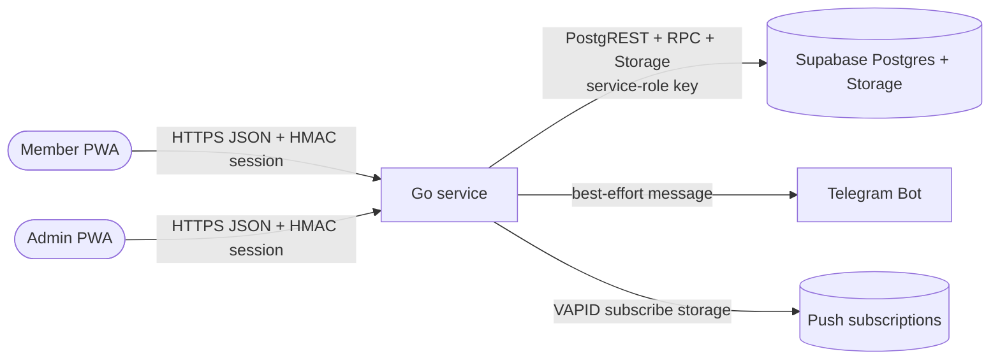
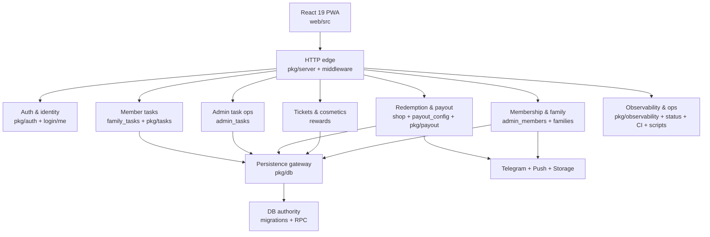
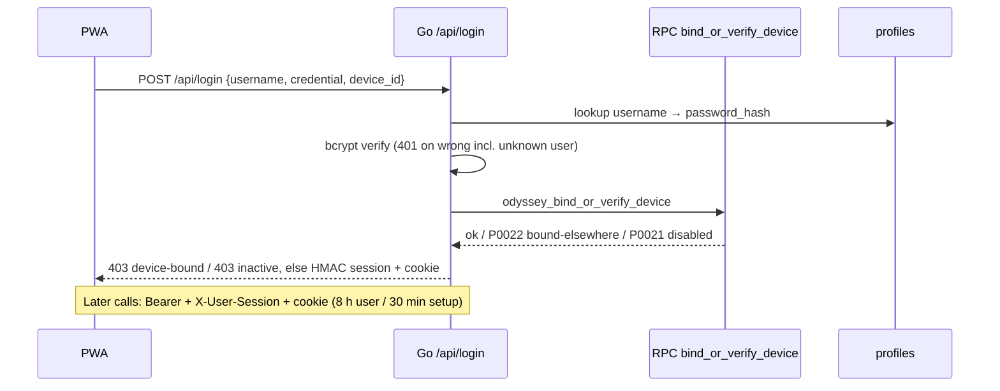
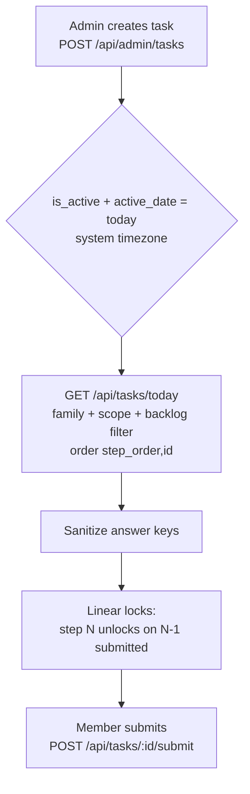
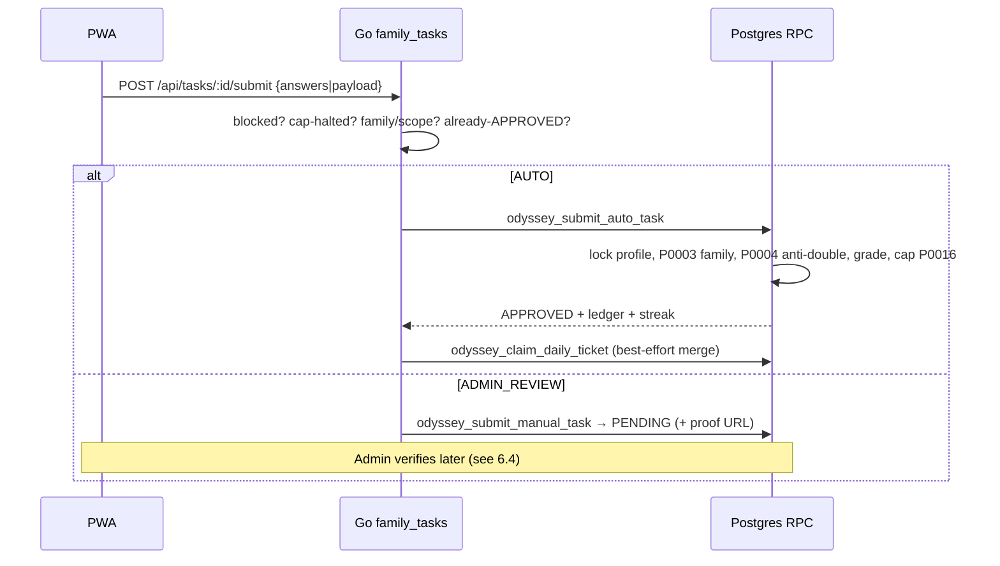
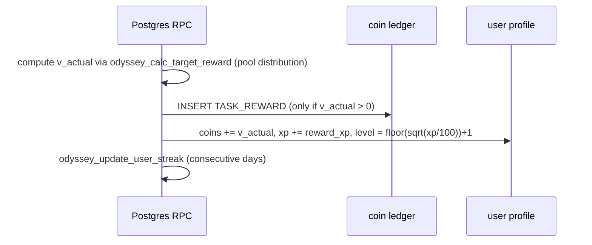
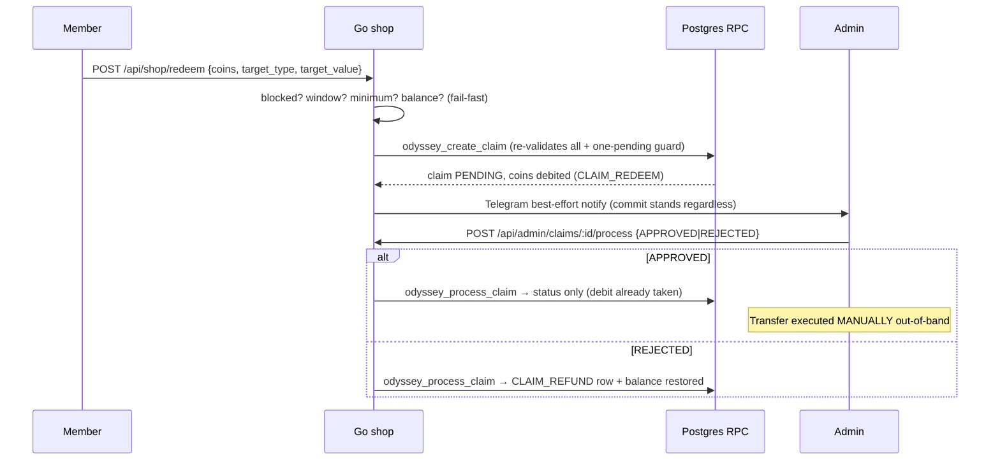

# Architecture

Main system explanation for someone who has never seen Odyssey. Pragmatic
use of arc42 concepts, merged into one file — the system is a single-team
monolith and splitting it would add navigation cost without maintenance
value.

## 1. System purpose

Odyssey is a **private family daily-task → coin → redemption platform**:

- An **admin** publishes a sequenced task list per day (video, quiz,
  photo/document upload, text answer, mini-game).
- A **member** completes tasks in a mobile-first PWA.
- Submissions are **graded automatically in Postgres** (quizzes, games) or
  **queued for admin review** (uploads, essays, photos).
- Approved work earns **coins + XP + streaks + levels**.
- Coins are **redeemed from a reward catalog** (pulsa, e-wallet, cash) via
  **admin-approved claims**; the money transfer itself is **manual**.
- A parallel loop grants **daily reward tickets** redeemable for **avatar
  cosmetics** (frames, effects).

What Odyssey is **not**: no public signup, no payment gateway, no external
identity provider, no message broker, no cache server, no cron daemon, no
AI grading. The only background work is the in-process rate-limiter cleanup
ticker.

## 2. Actors

| Actor | Description | Evidence |
|---|---|---|
| Member | Family user (`MEMBER`) doing daily tasks, redeeming coins, collecting cosmetics | `web/src/features/{home,stepper,shop,collection,profile}` |
| Admin | Family admin (`ADMIN`; legacy `GUIDE`/`BUILDER` normalize to admin) managing tasks, submissions, members, claims, config | `web/src/features/admin`, `NormalizeRole` in `pkg/auth/middleware.go` |
| System | Go service + Postgres RPCs enforcing grading, ledger, caps | `pkg/server/server.go`, `supabase/migrations/042–088` |
| Telegram bot | Best-effort admin notification on new claims | `pkg/shared/telegram.go`, called only from `internal/api/shop/api.go` |
| Push service | VAPID web-push delivery (subscribe storage wired; sender has no production call sites) | `internal/api/push/index.go`, `pkg/push/sender.go` |

All users belong to exactly one **family** (`family_id`) — the tenancy root.
Members are created by an admin; there is no self-registration.

## 3. System context



Boundaries:

- Browser **never** talks to Supabase directly. RLS allows service-role
  full access; authorization lives in Go handlers and RPCs.
- The Go client refuses any table outside its 15-entry allowlist
  (`pkg/db/supabase.go`) — new tables need a code change, not just a
  migration.
- Proof files live in the `task-proofs` Storage bucket (public bucket —
  see §11 risks).
- Verified absent (no SDK, no client, no calls): external IdPs, payment
  gateways, brokers, cache servers, Family Reward/quota systems.

## 4. High-level architecture



Request path:

```text
Browser
  ↓ HashRouter + SessionProvider + per-feature hooks
React PWA (never grades, never sees answer keys)
  ↓ fetch, same-origin (VITE_API_BASE_URL override), Bearer + X-User-Session + cookie
Go API (middleware → auth → handler: validate, tenancy pre-check, RPC call)
  ↓ PostgREST / rpc / Storage with service-role key
Supabase Postgres (RPCs re-validate everything, then commit authoritatively)
```

## 5. Building blocks

| Block | Responsibility (owns) | Does NOT own | Key sources |
|---|---|---|---|
| **B1 Web PWA** | Routing, session bootstrap, per-type task UI, admin consoles, shop/redeem UI, ticket/cosmetic UI | Grading, answer keys, coin math | `web/src/app`, `web/src/features/{login,home,stepper,shop,collection,profile,admin,auth}`, `web/src/shared` |
| **B2 HTTP edge** | Route table, middleware chain, timeouts, graceful shutdown, static `web/dist` | Business rules | `pkg/server/server.go`, `internal/api/dev/main.go`, `api/index.go` |
| **B3 Auth & identity** | bcrypt verify, device bind, HMAC issue/parse, password/avatar self-service | Authorization policy per domain (each handler checks role) | `pkg/auth/*`, `internal/api/login`, `internal/api/me` |
| **B4 Member tasks** | Today-list, submit intake, cap gate display, proof upload | Grading math, coin writes | `internal/api/family_tasks`, `pkg/tasks` validators |
| **B5 Admin task ops** | Task CRUD/duplicate/reorder, submission queue + verify/edit, economy/cosmetic config writes | Final reward math (RPC) | `internal/api/admin_tasks` |
| **B6 Redemption & payout** | Catalog, redemption config, member claims, admin claim processing, payout-frequency policy | Money transfer (manual, out-of-band) | `internal/api/shop`, `internal/api/payout_config`, `pkg/payout` |
| **B7 Tickets & cosmetics** | Daily claim, open box, collection, equip | Ticket eligibility root (RPC checks approved work) | `internal/api/rewards` |
| **B8 Membership & family** | Member CRUD, block/unblock, device reset, targets/caps, banner/theme | Auth session mechanics | `internal/api/admin_members`, `internal/api/families`, `pkg/db` stores |
| **B9 Persistence gateway** | REST/RPC/Storage wrapper, allowlist, exact-count pagination | Business rules (none) | `pkg/db/supabase.go` + stores |
| **B10 DB authority** | Grading, ledger appends, streak, caps, isolation, anti-double-claim | Presentation, auth transport | `supabase/migrations/042–088` |
| **B11 Integrations** | Telegram best-effort notify, push subscribe storage + sender | Delivery guarantees (none) | `pkg/shared/telegram.go`, `pkg/push/*` |
| **B12 Observability & ops** | Request IDs, structured logs, metrics, profiler, health gates, CI, scripts | Business behavior | `pkg/observability/*`, `internal/api/status`, `scripts/` |

### Edge details (B2)

- Entrypoints: `internal/api/dev/main.go` (`main()` loads `.env`, builds
  handler, `http.Server` with 10/30/60/120 s timeouts, 30 s graceful
  shutdown) and `api/index.go` (Vercel lazy-singleton handler).
- Middleware order (outer → inner): observability wrap (request-ID, panic
  recover, metrics, logs) → security headers → CORS → body limit →
  rate limit → session auth.
- Rate limits are **in-memory per instance**: login 5, admin 30, general
  100 per 60 s. `CSRFMiddleware` exists but is **not wired**; only
  `/api/csrf` issuance is served (consumed by push calls).
- There is **no backend logout route** — logout is client-side token clear
  (`web/src/shared/lib/auth.ts`).

## 6. Core runtime flows

### 6.1 Authentication



- Credential model: `username` + `password_hash` on `odyssey_user_profiles`
  (legacy plaintext fallback exists in `pkg/auth/password.go` for old rows).
- First login binds `device_id`; a different device gets
  `403 "Akun sudah terhubung ke perangkat lain…"` until an admin resets the
  binding (`POST /api/admin/members/{uid}` with `reset_device`, backed by
  RPC `odyssey_admin_reset_device`).
- Sessions are HMAC-signed (`payload.HMAC-SHA256`), not JWT. Roles are
  normalized: `ADMIN|GUIDE|BUILDER → ADMIN`, everything else → `MEMBER`.
- Password change: `POST /api/me/change-password` (min 6 chars; current
  password required unless `must_change_password`); new members are created
  with `must_change_password=true` and see a blocking modal.

### 6.2 Daily task lifecycle



- **10 task types**: `VIDEO, QUIZ, PHOTO_UPLOAD, DOCUMENT_UPLOAD,
  TEXT_RESPONSE, MINI_GAME, VIDEO_QUIZ, PHOTO_PROOF, GENERAL,
  YOUTUBE_VIDEO` (`web/src/shared/types/index.ts`; Go additionally accepts
  `CHECKLIST`).
- **Evaluation**: explicit value wins; else `PHOTO_UPLOAD / DOCUMENT_UPLOAD
  / TEXT_RESPONSE / PHOTO_PROOF → ADMIN_REVIEW`, everything else `AUTO`.
  Config-aware override: `VIDEO` + essay prompt or + recording enabled →
  `ADMIN_REVIEW` even if stored `AUTO`
  (`ResolveEvaluationTypeForConfig`, `pkg/tasks/validator.go`).
- **Today-list** (`HandleGetToday`): system-timezone date (DB key `timezone`
  wins, else `Asia/Jakarta`) → family's active tasks for that date →
  drop `USER`-scoped tasks for other UIDs → drop backlog before join date
  → strip answer keys (recursive `sanitizeValue`, covers
  `correct_answer/correct_ans/expected_answer/answer_key/is_correct/answer/
  solution/correct/correct_option`) → evaluate linear locks → return
  `{tasks[], earning_locked, earning_cap, earned}`.
- Statuses: `LOCKED / UNLOCKED / PENDING / APPROVED / REJECTED`. A step is
  `UNLOCKED` only if the previous step is submitted (`APPROVED` or
  `PENDING`); `REJECTED` re-locks the next step so the member must fix and
  resubmit.
- PWA refetches on mount, UID switch, window focus/online/visibility — the
  list is always server-derived.

### 6.3 Submission processing (auto vs manual)



- **AUTO** (quizzes, games): deterministic quiz matching and mini-game
  0–1M bounds run **in SQL** (`047` hardening). Server recomputes game
  scores; the client-sent score is ignored.
- **ADMIN_REVIEW** (uploads, essays, photos): stored `PENDING` with the
  proof URL (uploaded first via `POST /api/tasks/upload` → `task-proofs`
  bucket, 10 MiB limit, executable/content-type blocklist).
- Re-submit of an `APPROVED` task → `400/P0004` (expected exactly-once
  behavior, not a bug).

### 6.4 Manual review

Admin queue: `GET /api/admin/submissions (?status=&page=&limit=)`, exact-
count pagination, family-bounded. Actions:

- `POST /api/admin/submissions/{id}/verify {APPROVED|REJECTED, notes?,
  penalty_coins?}` → RPC `odyssey_verify_submission` (admin-role check,
  `PENDING`-only, family check; `REJECTED` may carry a penalty that writes
  a negative `TASK_PENALTY` ledger row).
- `PATCH /api/admin/submissions/{id} {payload, notes?}` → RPC
  `odyssey_admin_edit_submission` (bounded text/score edits).

### 6.5 Reward / ledger (coins, XP, streak, level)



- **Coins ≠ XP**: coins come from the scaled target-pool distribution;
  XP is per-task `reward_xp` (default 100). A zero-coin approval still
  grants XP + streak.
- **Level formula** (SQL-side only, mirrored read-only in
  `web/src/shared/lib/level.ts`): `level = floor(sqrt(xp/100)) + 1`.
- **Streak** (`odyssey_update_user_streak`): consecutive-day counter on DB
  `CURRENT_DATE`; NULL→1, today→unchanged, yesterday→+1, else reset 1.
- **Double-reward prevention** (defense in depth): `UNIQUE(task_id,
  user_uid)` + RPC `P0004` approved-guard + profile `FOR UPDATE` lock +
  ledger-exists check on the verify path + ticket PK + consume-under-lock.
- **Earning cap**: calendar-month `TASK_REWARD` sum vs effective cap
  (per-user → system default → fallback; `0` = unlimited with no bonus or
  ceiling). Enforced **inside both RPCs** (`P0016`) under profile lock;
  Go mirrors it for display (`earning_locked/earning_cap/earned`) and
  fail-fast `403 EARNING_CAP_REACHED` on submit.

### 6.6 Redemption / payout



- Redemption config: window days, conversion rate, max payout, minimum
  withdrawal, payout frequency per user (`THRESHOLD / WEEKLY / MONTHLY`
  with weekday/month-window). Precedence: per-user row beats system keys.
- Claim guards: `P0006` one pending claim per user, `P0014` below minimum,
  `P0015` outside weekly/monthly schedule, `P0003/P0007` profile/balance.
  No lifetime max-payout cap on withdrawal since `095` (earning is capped
  upstream via `P0016`); `max_payout_coins` remains exposed in config for
  backward compat but no longer blocks claims.
- **Approve moves no coins** (debit happened at create); **reject refunds**
  via a new `CLAIM_REFUND` row. Transfer tooling is `UNVERIFIED` — the team
  transfers manually and keeps receipts per team policy.

### 6.7 Ticket / cosmetic loop (secondary)

`GET /api/rewards` (ticket count) → `POST /api/rewards/claim` (needs ≥1
**today's** `APPROVED` submission in system timezone; idempotent by
`(user_uid, ticket_date)` PK) → `POST /api/rewards/open` (consumes oldest
`GRANTED` ticket under lock, random active cosmetic, tier bump max 3,
persists before return) → `GET /api/rewards/collection` →
`POST /api/rewards/equip {cosmetic_id}` (frames → `avatar_frame`, effects
→ `equipped_explorer_effect`; profile is display source-of-truth).

Tables `reward_tickets`, `user_cosmetics`, `cosmetic_items` are the
non-prefixed naming exception. Fixed UI wording: "Tiket Hadiah / Buka
Hadiah / Koleksi".

## 7. Business-rule ownership (critical)

| Rule | Owner | Go role | Notes |
|---|---|---|---|
| Quiz grading, game bounds | **Postgres** (`047`, `073`) | fail-fast shape checks only | Server recomputes; client score ignored |
| Coin/XP/level/streak writes | **Postgres** (`073`, `048`) | none (never mints) | Single plpgsql body = implicit transaction |
| Anti-double-claim | **Postgres** (`UNIQUE` + `P0004`) | pre-check for friendly errors | Adversarial-tested (100× concurrent) |
| Ledger immutability | **Postgres** (trigger, `P0012`) | never UPDATE/DELETE | Corrections = new rows |
| Earning cap resolution + enforcement | **Postgres** (`079`, `071`, `073`) | mirror for display + fail-fast 403 | `0` = unlimited; keep defaults in sync |
| Claim validation (window/min/freq/max) | **Postgres** (`069`) | fail-fast mirror (`pkg/payout`) | RPC re-validates everything |
| Device bind/verify | **Postgres** (`054`) with Go fallback PATCH | maps errors to 401/403 | Mismatch → 403 until admin reset |
| Answer-key stripping | **Go** (sanitizer) | authoritative for HTTP | Must cover every new question-like field |
| Family tenancy | **Go + SQL** | filter + pre-check | RPC re-checks (`P0003`) |
| Linear step unlocks | **Go** (today-list) | presentation + gating | Derived per request, not stored |
| Upload limits/types | **Go** | enforced at intake | 10 MiB, blocklist, content-type sniff |
| Level display | **Go/TS mirror** | read-only | Formula owned by SQL |

Rule of thumb: **if money-like state moves, the RPC owns it; Go validates
fast and explains failures.** Never trust the browser for grading, coins,
caps, or claim eligibility.

## 8. Security architecture

- **Auth**: local username/password, bcrypt (with legacy-plaintext fallback
  for old rows — re-hash on next change). Unknown users get the same 401
  as wrong passwords (no enumeration).
- **Sessions**: HMAC-SHA256, triple transport (Bearer → `X-User-Session` →
  `odyssey_session` cookie, HttpOnly, Lax). 8 h user / 30 min setup tokens.
- **Device binding**: one device per account; mismatch is 403 until admin
  reset. Clients persist `odyssey_device_id` in localStorage.
- **Authorization**: every `/api/admin/*` handler calls `requireAdmin`
  (normalized roles); family scoping in Go filters, re-checked in SQL.
- **Edge**: security headers, CORS allow-list (empty = allow-all — set in
  prod), 1 MiB body limit (10 MiB for uploads), per-instance rate limiters.
- **Secrets**: `SUPABASE_SERVICE_KEY` and `SESSION_SIGNING_SECRET` are
  server-only; the browser holds only its own HMAC session. `PARENT_ID` is
  boot-required but unused (do not remove without a config change).
- **Storage**: `task-proofs` bucket is public (known risk, §11).

## 9. Cross-cutting concerns

- **Configuration as data**: windows, rates, targets, caps, bonuses, payout
  policy, timezone, announcements live in `odyssey_system_config` (+
  per-user payout overrides); precedence user → system key → compiled
  default (`079` made the DB the source-of-truth; no hardcoded business
  config in Go/TS/SQL).
- **Timezone-derived math**: day/month/period boundaries follow the system
  timezone (`Asia/Jakarta` default, DB key wins). Month = calendar month
  for caps; target distribution period is 1–24 (see `database.md`).
- **Idempotency**: unique pairs + approved guards + consume-under-lock make
  submit/verify/claim/ticket-open retry-safe.
- **Observability**: request IDs, structured logs, in-process metrics
  (token-gated `/metrics`), profiler, health gates over config + three
  table probes, schema version surfaced at boot and `/api/status`.
- **UX copy**: Indonesian throughout; fixed cosmetic wording; push toggle
  copy is English (known inconsistency).

## 10. Quality / reliability (evidence only)

Verified by tests/CI: no-enumeration login failures, answer-key sanitizer,
rate/body limits, ledger immutability, anti-double-claim (incl. adversarial
concurrency), fail-fast boot validation, health gates, graceful shutdown,
blocking lint/type/test/build CI.

`UNDEFINED` (no SLO evidence): latency targets, multi-instance behavior
(limiters don't coordinate), OS-level push delivery (sender has no
production call sites — `UNVERIFIED` end-to-end).

## 11. Risks / technical debt (evidence-based)

- Public `task-proofs` bucket — proof URLs are guessable bearer tokens.
- Real-money catalog with manual payout and no in-app transfer trail —
  reconciliation risk.
- Earning math split Go↔SQL with subtly different fallbacks (Go `-1`
  unconfigured vs old RPC 3320) — must be tested jointly.
- Mandatory-but-unused `PARENT_ID`; oversized `admin_tasks` handler and
  `shared/config.go`; 80+ migration files with `UNVERIFIED` fresh-replay
  order (use the `scripts/apply-migration-*.cjs` pattern).
- Manual daily task seeding (migrations `080–088` + seed scripts).
- Per-instance rate limiters (no coordination).
- Non-prefixed ticket/cosmetic tables (naming exception).
- Frontend `uploadTaskProof` reads a stale `odyssey_session_token`
  localStorage key while the session lives under `odyssey_session`
  (`web/src/shared/lib/compress.ts` vs `session.ts`) — verify before
  relying on upload auth behavior.
- Admin `/admin` role-guard redirects to non-existent `/home` (falls
  through to `/` — harmless but sloppy).

## 12. Glossary

- **Member** — `MEMBER` user doing tasks. **Admin** — `ADMIN` user
  (legacy `GUIDE`/`BUILDER` count as admin via `NormalizeRole`).
- **Family** — tenancy root (`odyssey_families`); every profile and task
  belongs to one.
- **Task** — daily definition (`odyssey_tasks`); 10 types; `AUTO` (graded
  in SQL) vs `ADMIN_REVIEW` (human verifies).
- **Submission** — one attempt per user per task
  (`PENDING → APPROVED | REJECTED`).
- **Coin / XP** — separate balances; coins redeem, XP levels.
- **Level** — `floor(sqrt(xp/100)) + 1`. **Streak** — consecutive active
  days. **Target** — monthly coin goal. **Cap** — monthly earning ceiling
  (`0` = unlimited).
- **Ledger** — `odyssey_coin_transactions`, append-only (`TASK_REWARD`,
  `TASK_PENALTY`, `CLAIM_REDEEM`, `CLAIM_REFUND`).
- **Catalog** — `odyssey_reward_catalog` (`PULSA / EWALLET / CASH /
  SPECIAL`).
- **Claim** — redemption request (`PENDING → APPROVED | REJECTED`);
  approve settles off-system, reject refunds.
- **Redemption window** — days claims may be created. **Payout policy** —
  per-user `THRESHOLD / WEEKLY / MONTHLY` schedule.
- **Ticket** — daily reward ticket, max 1/user/day, only with today's
  approved work (`GRANTED → SPENT`). **Cosmetic** — avatar frame/effect,
  tier 1–3, equipped on profile.
- **Device binding** — one `device_id` per account, admin-resettable.
- No adventure-era terms apply (journey/mission/quest/RPG/gatekeeper are
  obsolete).
