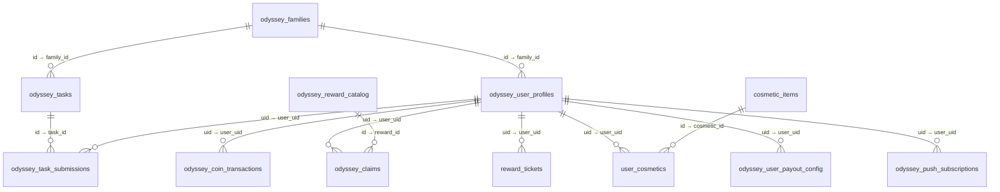

# Database

Handover for the Supabase Postgres behind Odyssey. Read the migrations and
RPCs — this file summarizes them; the SQL decides.

- **Technology**: Supabase Postgres, reached via PostgREST + RPC + Storage
  with the **service-role key**, server-side only (`pkg/db/supabase.go`).
- **RLS posture**: locked-down service-role-only. Every `odyssey_*` /
  `reward_*` / cosmetic table does `ENABLE ROW LEVEL SECURITY` + a single
  `FOR ALL TO service_role USING (true)` policy. The browser never gets
  direct DB access; authorization is enforced in Go handlers and RPCs.
- **Gateway**: the Go client refuses any table outside its 15-entry
  allowlist — new tables need a **migration AND** an `allowedTables` entry
  in `pkg/db/supabase.go` (currently: `odyssey_user_profiles`,
  `odyssey_families`, `odyssey_tasks`, `odyssey_task_submissions`,
  `odyssey_reward_catalog`, `odyssey_claims`, `odyssey_coin_transactions`,
  `odyssey_push_subscriptions`, `odyssey_schema_version`,
  `odyssey_system_config`, `odyssey_user_payout_config`,
  `odyssey_member_monthly_targets`, `reward_tickets`, `user_cosmetics`,
  `cosmetic_items`).
- **Migrations**: 91 files in `supabase/migrations/` (numbered `001–088`
  with `016` missing, plus ad-hoc `check_*.sql`). Business core is
  `042–088`; daily task seeding continues via `080–088` + scripts.
  Fresh full-replay order is `UNVERIFIED` — apply with the
  `scripts/apply-migration-*.cjs` pattern and confirm
  `odyssey_schema_version` + `/api/status`.



## Domain tables

Format: purpose → key relationships/columns → who writes / who reads →
constraints.

### Identity & tenancy

- **`odyssey_user_profiles`** — identity + balances + progression.
  `uid` PK, `family_id` FK, `username` (credential SOT since `076`),
  `password_hash`, `device_id`, `role`, `is_active`, `must_change_password`,
  `blocked_at/by/reason`, `level/xp/coins (CHECK coins >= 0)`,
  `monthly_coin_target`, `monthly_earning_cap (0–10000, 0 = unlimited)`,
  `streak_days`, `last_active_date`, `avatar_*`.
  Written by: admin member handlers, auth (device bind, password change),
  RPCs (balances/streak, under `FOR UPDATE` lock). Read by: login, today-
  list, admin list, cap math.
- **`odyssey_families`** — tenancy root. `id` PK, `name`, `banner_url`,
  `theme` (only banner/theme are member-patchable).

### Tasks & submissions

- **`odyssey_tasks`** — daily definitions. `family_id` FK NOT NULL,
  `task_type` (10 values + Go `CHECKLIST` compat), `evaluation_type`
  (`AUTO`/`ADMIN_REVIEW`), `step_order`, `active_date`, `reward_coins/xp`
  (rewards default 50/100 on create when 0), `config JSONB`,
  `target_scope` (`ALL`/`FAMILY`/`USER`) + `target_user_uid`, `is_active`.
  Served ordered by `(step_order, id)`; unique active step per
  family/date (`uq_tasks_family_date_step_active`, `072`); index on
  `(family_id, active_date, step_order)` where active. Written by admin
  task handlers; read by today-list (family/date/active filtered).
- **`odyssey_task_submissions`** — attempts. `task_id`, `user_uid`,
  `submission_type` (`AUTO_QUIZ`/`MANUAL_VERIFY`), `status`
  (`PENDING/APPROVED/REJECTED`), `payload JSONB`, `coins/xp_earned`,
  `admin_notes`, `reviewed_at/by`. **`UNIQUE(task_id, user_uid)`** — one
  rewarded approval per user per task. Written by submit/verify/edit RPCs;
  read by today-list (status map), admin queue, ticket eligibility.

State machine:

```text
(submit AUTO) ──→ APPROVED            (coins/XP/level/streak committed)
(submit MANUAL) ─→ PENDING ──verify──→ APPROVED (+ledger) | REJECTED (+optional TASK_PENALTY)
REJECTED member fix + resubmit is a row UPDATE, not a new row (UNIQUE pair).
```

### Ledger (money-like state)

- **`odyssey_coin_transactions`** — immutable ledger. `user_uid`, `amount`,
  `type` (`TASK_REWARD | TASK_PENALTY | CLAIM_REDEEM | CLAIM_REFUND`),
  `reference_id`, `description`, `created_at`. Trigger
  `trg_odyssey_coin_transactions_immutable` aborts `UPDATE`/`DELETE`
  (`P0012`). Profile `coins` is derived state; the ledger is the audit
  trail. Corrections are **new rows**, never edits. Index on
  `(user_uid, created_at DESC)`.

Ledger semantics per flow:

| Flow | Rows written |
|---|---|
| Auto/manual approval | `+v_actual TASK_REWARD` (skipped when `v_actual = 0`; XP/streak still granted) |
| Reject with penalty | `-penalty TASK_PENALTY` (capped at current balance) |
| Claim create | `-coins CLAIM_REDEEM` (balance debited immediately) |
| Claim approve | **no row** (debit already taken; transfer is manual) |
| Claim reject | `+coins CLAIM_REFUND` (balance restored) |

### Redemption

- **`odyssey_reward_catalog`** — `title`, `description`, `category`
  (`PULSA/EWALLET/CASH/SPECIAL`), `cost_coins > 0`, `icon_name`,
  `is_available`. Seeded with pulsa/e-wallet/cash items (`043`).
- **`odyssey_claims`** — `user_uid`, `reward_id` FK, `coins_redeemed`,
  `target_type/value`, `status (PENDING/APPROVED/REJECTED)`,
  `admin_notes`, `processed_at`. Partial unique
  `uq_one_pending_claim_per_user` — one `PENDING` claim per user.

State machine: `PENDING → APPROVED` (status + `processed_at` only) or
`PENDING → REJECTED` (status + `CLAIM_REFUND` row). No other transitions;
processed claims raise `P0004`.

### Config & policy

- **`odyssey_system_config`** — KV runtime config: redemption window
  (`redemption_start/end_day`), payout day/targets/rate/max
  (`coin_conversion_rate`, `max_payout_coins`, payout target days),
  `timezone`, earning window days, default target/cap
  (`default_monthly_coin_target`, `default_monthly_earning_cap`),
  `max_monthly_earning_cap_ceiling`, `level_cap_bonus` JSON,
  `auto_block_inactivity_days` (execution removed in `067`, keys remain),
  `announcement_*`. DB is source-of-truth since `079`.
- **`odyssey_user_payout_config`** — per-user `payout_frequency`
  (`THRESHOLD/WEEKLY/MONTHLY`), minimum withdrawal (floor = system
  minimum), weekday/month windows. Beats system keys when present.
- **`odyssey_member_monthly_targets`** — per-member monthly accrual
  snapshot for the admin dashboard (period 1–24 via
  `odyssey_target_period_bounds`; kept after `071` moved caps to calendar
  month — distribution still uses 1–24).

### Tickets & cosmetics (non-prefixed exception)

- **`reward_tickets`** — `(user_uid, ticket_date)` PK, `GRANTED → SPENT`,
  `awarded_cosmetic_id`. Max one/user/day; only with today's approved work.
- **`cosmetic_items`** — `id`, `slot` (`frame|effect`), `asset`, `tier`,
  `is_active` (+ `name` since `079`). Seeded `frame-gold`,
  `effect-sparkle/float/trail` (`078`).
- **`user_cosmetics`** — `(user_uid, cosmetic_id)` PK, tier 1–3
  (`LEAST(tier+1,3)` on re-win), `equipped` (best-effort; profile
  `avatar_frame`/`equipped_explorer_effect` is display SOT).

### Infra

- **`odyssey_push_subscriptions`** — `uid`, `endpoint`, `p256dh`, `auth`.
- **`odyssey_schema_version`** — migration marker surfaced in
  `/api/status` and boot logs.

Dead/legacy tables are dropped (`044`, `046`, `077` removed RPG-era and
`odyssey_local_users` tables). Do not document dropped tables as active.

## RPCs (`SECURITY DEFINER`, service-role only)

All re-validate tenancy, status, and limits — Go pre-checks are
fail-fast UX, not authority.

| RPC | Migrations | Purpose / guards |
|---|---|---|
| `odyssey_submit_auto_task(task, user, answers)` | `073` current (hardened `044/045/047`) | Profile lock → task active (`P0001`) → family match (`P0003`) → anti-double (`P0004`) → cap (`P0016`) → deterministic quiz grading / mini-game 0–1M bounds (`P0008/P0009`) → APPROVED upsert + ledger + coins/XP/level + streak |
| `odyssey_submit_manual_task(task, user, payload)` | `043`+, revised `074` (VIDEO-essay) | Same tenancy/double guards → `PENDING` row with proof payload |
| `odyssey_verify_submission(id, admin, status, notes?, penalty?)` | `073` current (hardened `060`) | Admin-role (`P0003`) → `PENDING`-only (`P0004`) → family check → ledger-exists check (`P0004`) → APPROVED (+ledger/streak, penalty-on-approve `P0005`) or REJECTED (+optional `TASK_PENALTY`) |
| `odyssey_admin_edit_submission(id, admin, payload, notes?)` | `060` | Bounded payload/notes edit of a submission |
| `odyssey_create_claim(user, coins, target_type, target_value)` | `095` current (`069` before) | `P0010` coins>0 → `P0011` target → `P0006` one-pending → `P0014` minimum → `P0015` schedule → balance (`P0003/P0007`) → INSERT `PENDING` + `CLAIM_REDEEM` debit |
| `odyssey_process_claim(id, status, notes?)` | `042` | APPROVED: status + `processed_at` (no ledger row). REJECTED: status + `CLAIM_REFUND` row |
| `odyssey_update_user_streak(user)` | `043`, fixed `048` | NULL→1, today→unchanged, yesterday→+1, else reset 1 (DB `CURRENT_DATE`) |
| `odyssey_get_effective_earning_cap(user)` | `079` current (`070`, `078` before) | Per-user → system default → `P0026` fail-closed; `0` = unlimited (early return, no bonus); level-bonus map + ceiling clamp |
| `odyssey_earned_this_period(user)` / `odyssey_is_earning_halted(user)` | `071` current | Calendar-month `TASK_REWARD` sum vs cap; `cap <= 0` → not halted |
| `odyssey_calc_target_reward(target, task, …)` | `061` canonical 4-arg (`063` dropped the 3-arg overload) | Largest-remainder pool distribution → per-task coin actually awarded |
| `odyssey_claim_daily_ticket(user)` | `079` current | Active profile (`P0021`) → today's APPROVED work in system tz (`P0023`) → idempotent insert by PK |
| `odyssey_open_reward_box(user)` | `078` | Oldest `GRANTED` ticket under lock (`P0024` if none) → random active cosmetic (`P0025` if none) → tier upsert, ticket marked `SPENT` before return |
| `odyssey_bind_or_verify_device(user, device)` | `054` | First bind or verify; `P0022` bound-elsewhere, `P0021` disabled |
| `odyssey_admin_reset_device(user)` | `054` | Clears binding (Go also NULLs columns) |
| `odyssey_block_user` / `odyssey_unblock_user` | `065` | Manual block/unblock (auto-block execution removed in `066/067`) |
| `odyssey_get_effective_payout_config(user)` | `069` | Per-user row or system defaults (frequency/minimum/windows) |

Error-code convention: `P0001` inactive · `P0002` not found · `P0003`
family/access · `P0004` already done/processed · `P0005` invalid
status/penalty · `P0006` pending-claim exists · `P0007` profile missing ·
`P0008/P0009` grading/validation · `P0010/P0011` claim input · `P0012`
ledger mutation · `P0014` below minimum · `P0015`
schedule · `P0016` cap halted · `P0021` disabled · `P0022`
device-bound · `P0023` no approved work · `P0024/P0025` ticket/box empty ·
`P0026` cap unconfigured · `P0027` timezone unconfigured.

## Invariants (must never break)

1. One rewarded approval per user per task (`UNIQUE` + `P0004`).
2. Ledger append-only (trigger `P0012`); corrections are new rows.
3. Non-negative coin balances (`CHECK` + pre-checks; penalties capped).
4. Answer keys never reach the browser (Go sanitizer covers every new
   question-like field).
5. Cap `0` = unlimited; bonus/ceiling must not apply; cap period is the
   calendar month in system timezone.
6. Tickets: max one/user/day, only with today's approved work; open
   consumes under lock.
7. Claims need window + balance + minimum + frequency; approval moves no
   coins (debit at create); rejection refunds; transfer is out-of-band.
8. Family isolation enforced in both Go filters and SQL checks (`P0003`).
9. New tables require migration + allowlist entry.
10. Transaction boundaries: each RPC body is one implicit transaction with
    `SELECT … FOR UPDATE` on the profile (and submission on verify) —
    earned sums are re-read after the lock.

## Migration conventions

- Numbered `NNN_description.sql` with a header comment stating purpose;
  business changes live in `042+`. Daily task content seeds (`080–088`)
  deactivate-then-insert per date — never hand-delete rows (note `085`:
  immutable ledger row blocked a `DELETE`).
- `odyssey_schema_version` is bumped by apply scripts; `/api/status`
  surfaces it for deploy verification.
- Hardcoded business config in SQL is banned since `079` — new tunables go
  in `odyssey_system_config` with Go/TS reading them, not literals.
